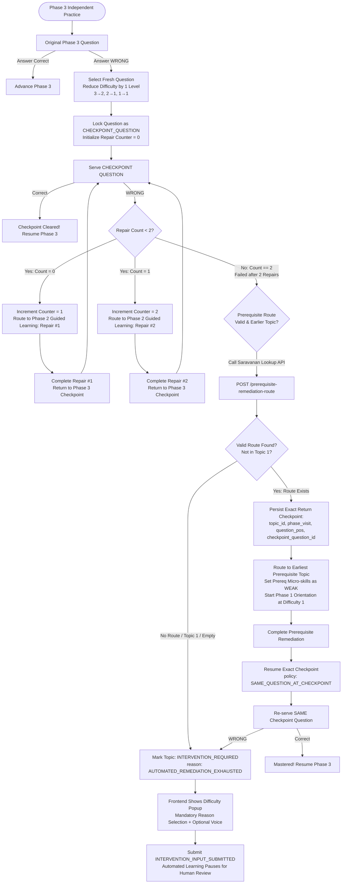

# Phase 3 Repeated Failure & Prerequisite Remediation Specification
**Document Version:** 1.0  
**Date:** 5 September 2026 / 7 September 2026  
**System:** Nablix | Student Model & Curriculum Architecture  
**Decision Reference:** Modify Phase 3 / Student Model Flow + 1 New Prerequisite Curriculum Lookup Endpoint  

---

## 1. Executive Summary & "Human" Conceptual Overview

### 1.1 The Core Problem Being Solved
Previously, a student struggling in **Phase 3 (Independent Practice)** could get trapped in an endless ping-pong loop between Phase 3 and **Phase 2 (Guided Learning)**. Furthermore, the system would sometimes trigger prerequisite remediation prematurely without giving the student a fair repair chance on the current skill, or it would throw new questions at them instead of verifying whether they could master the specific problem they previously missed.

### 1.2 The Simplified Human Analogy (How it Works)
Think of a student trying to solve an independent math problem:
1. **First Mistake**: Student fails Question A.  
   *Action:* The tutor doesn't punish them; it lowers the difficulty by 1 level and gives them a **Fresh Question (Question B)**. **Question B is now locked as the "Checkpoint Question".**
2. **Attempt Checkpoint Question (B)**: Student fails Question B.  
   *Action:* **Repair Cycle #1.** The student is sent to Phase 2 Guided Learning to re-learn the technique.  
3. **Return to Checkpoint**: After Repair #1, the student comes back to Phase 3.  
   *Rule:* We **do not** generate a new question. We give them **Question B again**.
4. **Second Failure on Question B**:  
   *Action:* **Repair Cycle #2.** The student gets a second (and final) guided brush-up in Phase 2.
5. **Return to Checkpoint**: Student returns to Phase 3 and attempts **Question B again**.
6. **Third Failure on Question B**:  
   *Diagnosis:* Two repairs on the current skill failed. The issue is *not* this topic—the student lacks an underlying foundation from an earlier topic!
7. **Prerequisite Escalation**:  
   *Action:* We ask Saravanan’s Curriculum service: *"What earlier prerequisite micro-skills and earliest topics does this skill depend on?"*
8. **Prerequisite Remediation**:  
   *Action:* Save the student's exact coordinates on Question B. Teleport them to the earliest prerequisite topic in Phase 1 (Orientation, Difficulty 1) with the prerequisite skills marked as `WEAK`.
9. **The Ultimate Return**:  
   *Action:* Once prerequisite learning is complete, teleport the student straight back to **Question B**.
10. **Final Verdict**:
   - **Pass:** Student solves Question B $\rightarrow$ Continue Phase 3.
   - **Fail (or No Prerequisite Route Exists / Stuck in Topic 1):** Automated remediation has exhausted its limits. The topic is flagged as `INTERVENTION_REQUIRED`. The student fills out a difficulty popup (selections + optional voice), and a human teacher steps in.

---

## 2. Visual Architecture & Flowchart



---

## 3. Clear Division of Responsibilities: Chiru vs. Saravanan

| Area / Feature | Chiru (Backend / Student Model Orchestration) | Saravanan (DB / Curriculum Service) |
| :--- | :--- | :--- |
| **Primary Domain** | **Runtime State, Orchestration, Flow Control & Events** | **Curriculum Knowledge Graph, DB Schemas & Persistence** |
| **Prerequisite Lookup Endpoint** | **CONSUMER:** Calls the endpoint when Repair Cycle count reaches 2 and the checkpoint question fails again. | **PROVIDER (NEW ENDPOINT):** Author and expose `POST /name` (Prerequisite route). Returns prerequisite micro-skills and earliest topic sequence. Pure factual lookup; does *not* make routing decisions. |
| **Repair Counter** | **IMPLEMENTS:** Tracks Phase 2 $\leftrightarrow$ Phase 3 repairs per `student_id + topic_id + micro_skill_id` (capped at max 2). Enforces that no 3rd repair is allowed. | **SCHEMA/STORE:** If state persistence is stored in DB, provides persistent column/store for the repair counter alongside journey state. |
| **Fresh Checkpoint Question Selection & Preservation** | **IMPLEMENTS:** Selects fresh question, applies difficulty drop ($3 \rightarrow 2, 2 \rightarrow 1, 1 \rightarrow 1$) *once*. Locks and re-serves the identical `checkpoint_question_id` after Repair #1, Repair #2, and post-remediation. | **CONTENT:** Ensures pool has tagged questions per difficulty level for Phase 3 micro-skills. |
| **Checkpoint State Persistence** | **IMPLEMENTS:** Constructs and stores the `return_checkpoint` object (`topic_id`, `phase`, `phase_visit_no`, `question_position_no`, `micro_skill_id`, `checkpoint_question_id`, `question_usage_id`, `SAME_QUESTION_AT_CHECKPOINT`). | **STORE:** Stores serialized checkpoint snapshot in DB / student journey profile so it survives crashes/sessions. |
| **Prerequisite Remediation Execution** | **IMPLEMENTS:** Flags prerequisite micro-skills as `WEAK`, dispatches student to Phase 1 Orientation (Difficulty 1), steps through topics in sequence, and resumes exact checkpoint upon completion. | **CURRICULUM MAPPING:** Maintains directed prerequisite links between micro-skills across KS3/curriculum units. |
| **Intervention Triggers (`INTERVENTION_REQUIRED`)** | **IMPLEMENTS:** Evaluates termination conditions: (1) no prereqs, (2) no earlier topic, (3) topic is Topic 1, (4) failed checkpoint after prereq remediation. Emits status and halts automation. | **STATUS PERSISTENCE:** Updates topic state in DB to `INTERVENTION_REQUIRED`. |
| **Student Difficulty Popup Handling** | **IMPLEMENTS:** Handles incoming `INTERVENTION_INPUT_SUBMITTED` event on existing event endpoint. Validates payload and routes to persistence. | **PERSISTENCE:** Stores intervention submission record (intervention ID, selected reasons, voice audio reference, voice transcript) for teacher review. |

---

## 4. Comprehensive Specification Details

### 4.1 Difficulty Reduction Rules
Difficulty reduction occurs **strictly once**—when the fresh Phase 3 question is first selected. It is never reduced again during repairs.
- **Previous Phase 3 Question Difficulty 3** $\rightarrow$ Fresh Checkpoint Question Difficulty **2**
- **Previous Phase 3 Question Difficulty 2** $\rightarrow$ Fresh Checkpoint Question Difficulty **1**
- **Previous Phase 3 Question Difficulty 1** $\rightarrow$ Fresh Checkpoint Question Difficulty **1**

### 4.2 Repair Cycle Counting
- **Scope:** Counter is scoped to `(student_id, topic_id, micro_skill_id)`. It is **not** session-wide or global.
- **Maximum Limit:** **2 repair cycles**.
- **Cycle 1:** Checkpoint Question failed $\rightarrow$ Route to Phase 2 (Repair #1) $\rightarrow$ Return to SAME Checkpoint Question.
- **Cycle 2:** Checkpoint Question failed $\rightarrow$ Route to Phase 2 (Repair #2) $\rightarrow$ Return to SAME Checkpoint Question.
- **Cycle 3:** **FORBIDDEN.** If Checkpoint Question fails after Cycle 2, escalate to Prerequisite Lookup.

### 4.3 Saravanan's New Endpoint Contract

#### Endpoint Definition
- **Method:** `POST`
- **Recommended Path:** `/curriculum/prerequisite-remediation-route` (or designated path)
- **Role:** Pure curriculum truth provider.

#### Request Payload
```json
{
  "request_id": "REQ-PREREQ-001",
  "current_topic_id": "ALG-KS3-03",
  "current_micro_skill_id": "T03.M5"
}
```

#### Response Payload
```json
{
  "schema_version": "1.0",
  "request_id": "REQ-PREREQ-001",
  "current_topic_id": "ALG-KS3-03",
  "current_micro_skill_id": "T03.M5",
  "prerequisite_micro_skills": [
    {
      "micro_skill_id": "T01.M3",
      "lowest_topic_id": "ALG-KS3-01",
      "lowest_topic_sequence": 1,
      "active": true
    },
    {
      "micro_skill_id": "T02.M2",
      "lowest_topic_id": "ALG-ORI-02",
      "lowest_topic_sequence": 2,
      "active": true
    }
  ],
  "ordered_prerequisite_topics": [
    {
      "sequence_no": 1,
      "topic_id": "ALG-KS3-01",
      "micro_skill_ids": [
        "T01.M3"
      ]
    },
    {
      "sequence_no": 2,
      "topic_id": "ALG-ORI-02",
      "micro_skill_ids": [
        "T02.M2"
      ]
    }
  ],
  "status": {
    "success": true,
    "status_code": "OK",
    "warnings": [],
    "operational_errors": []
  }
}
```

### 4.4 Checkpoint Return Persistence Payload (Chiru)
Before routing to the prerequisite topic, Chiru must persist:
```json
{
  "return_checkpoint": {
    "topic_id": "ALG-KS3-03",
    "phase": "PHASE_3_INDEPENDENT_PRACTICE",
    "phase_visit_no": 3,
    "question_position_no": 3,
    "micro_skill_id": "T03.M5",
    "checkpoint_question_id": "Q-T03-024",
    "question_usage_id": "QU-09823",
    "resume_policy": "SAME_QUESTION_AT_CHECKPOINT"
  }
}
```

### 4.5 Intervention Trigger Conditions (`INTERVENTION_REQUIRED`)
The system halts automated routing and flags `INTERVENTION_REQUIRED` if and only if:
1. **No Prerequisites:** Saravanan's lookup returns empty prerequisite micro-skills.
2. **No Earlier Topic:** The lookup returns prerequisites, but none belong to a valid earlier topic.
3. **Earliest Topic Boundary:** The unresolved skill is already in Topic 1 / the root curriculum topic.
4. **Post-Remediation Checkpoint Failure:** Student completes prerequisite remediation, returns to Phase 3, attempts the SAME checkpoint question, and answers WRONG.

#### Intervention Routing Payload
```json
{
  "routing": {
    "reason_code": "AUTOMATED_REMEDIATION_EXHAUSTED",
    "next_action": "COLLECT_INTERVENTION_INPUT"
  },
  "status": {
    "success": true,
    "status_code": "INTERVENTION_REQUIRED",
    "intervention_required": true
  }
}
```

### 4.6 Student Difficulty Input Popup & Event
Whenever `intervention_required: true`:
1. Manav's UI halts navigation and renders the modal popup: *"What are you finding difficult?"*
2. Student must select $\ge 1$ reason:
   - `DONT_UNDERSTAND_QUESTION`: "I do not understand what the question is asking."
   - `DONT_KNOW_HOW_TO_START`: "I do not know how to start."
   - `CANNOT_APPLY_CONCEPT`: "I understand the idea, but I cannot use it in this question."
   - `CONFUSING_SYMBOLS`: "The maths words or symbols are confusing."
   - `CALCULATION_MISTAKES`: "I keep making calculation/working mistakes."
   - `SOMETHING_ELSE`: "Something else."
3. Student may optionally provide voice audio/transcript.
4. Submission dispatches the following event to Chiru's existing event endpoint:

```json
{
  "event_type": "INTERVENTION_INPUT_SUBMITTED",
  "intervention_id": "INT-001",
  "student_id": "ST001",
  "topic_id": "ALG-KS3-03",
  "micro_skill_id": "T03.M5",
  "selected_reason_codes": [
    "DONT_KNOW_HOW_TO_START"
  ],
  "voice_input": {
    "provided": true,
    "audio_ref": "s3://nablix-audio/interventions/INT-001.webm",
    "transcript": "I know the rule but I get confused about which operation to use."
  }
}
```
*Note: Submitting this popup records evidence and holds the student safely; it does NOT resume automated learning.*

---

## 5. Summary Matrix for Immediate Execution

```
+----------------------------------------------------------------------------------------------------+
|                                    NABLiX PHASE 3 REMEDIATION MATRIX                               |
+------------------------------+----------------------------------+----------------------------------+
| COMPONENT / ACTION           | CHIRUDEVA (BACKEND / MODEL)      | SARAVANAN (DB / CURRICULUM)      |
+------------------------------+----------------------------------+----------------------------------+
| Checkpoint Question Selection| Drop diff by 1, freeze question  | Ensure question pool tagging     |
| Repair Counter Management    | Track max 2 repairs per skill    | Persist counter in student state |
| Prerequisite Escalation API  | Client / Caller (POST request)   | API Provider (POST endpoint)     |
| Prerequisite Remediation     | Mark WEAK, run Phase 1 Diff 1    | Graph linkages between skills    |
| Checkpoint Resume            | Re-serve SAME question ID        | Provide question metadata        |
| Intervention Gate            | Emit INTERVENTION_REQUIRED       | Persist intervention topic state |
| Difficulty Popup Submission  | Ingest via existing event route  | Store evidence (options + voice) |
+------------------------------+----------------------------------+----------------------------------+
```
